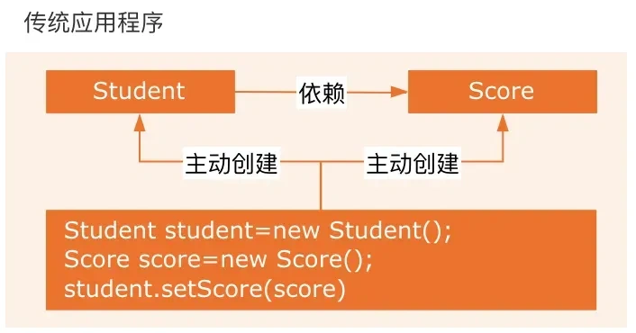
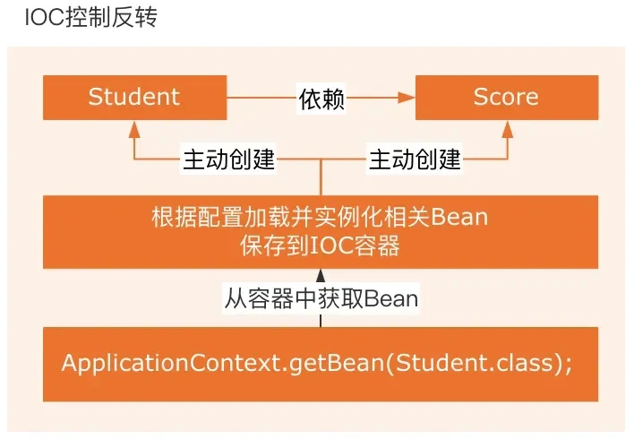

# Spring

[教程，这个还行，就是有点老了](https://www.bilibili.com/video/BV135411A7td?p=11&spm_id_from=pageDriver&vd_source=c7d5a94f91eb431153ada86d1d56c0ba)

# spring容器启动过程，源码

spring是一个ioc容器，这合理吗？哈哈

## 获取应用上下文

我们用的最多的就是 AnnotationConfigApplicationContext (加载Configuration注解标注的类), ClassPathXmlApplicationContext (加载xml文件写的配置)

以 AnnotationConfigApplicationContext 为主

AnnotationConfigApplicationContext 的有参构造函数里主要分为三个部分 this() register() refresh()

前两个是容器初始化，refresh是刷新容器，容器启动

下面这个不是很懂

AnnotatedBeanDefinitionReader用于获取一个或多个带有注解的具体类，之后将他们解析为BeanDefintion，之后注册到Registry中;ClassPathBeanDefinitionScanner用获取一个或多个包下的带有注解的类，之后将他们解析为BeanDefintion，注册到Registry中。

## 理解

1. ioc 控制反转，IOC容器，以前是我们主动去new一个对象，现在变成了ioc容器统一创建和组装这些对象。
2. aop 面向切片编程，例如事务和日志
3. Spring提供了统一的事务管理接口
4. MVC框架 model view controller

## ioc和aop

### ioc

控制反转，通过依赖注入（DI）来实现的。传统开发是我们通过new来获取对象。用ioc思想的话，ioc容器会自动帮我们实例化对象。大大降低对象之间的耦合度（哪里降低了，不就是方便吗，不然我们像写32的时候，开局初始化一堆对象，也挺麻烦的，主要是有的对象需要单例使用，java好像不好全局初始化，emmm）。

### aop

面向切面编程，通过动态代理实现，将哪些非主要业务的代码，封装起来，减少系统代码的重复，降低模块之间的耦合度。需要代理的对象，必须实现了某个接口，这样aop才会使用jdk proxy，去创建代理对象。没有接口的话，aop会创建一个cglib，生成子类作为代理？？？（不懂）

ioc容器管理service层和dao层的联系，aop实现事务管理、日志等功能。

## aop具体

分离核心任务和周边业务，面向切面编程，最小单元是切面。

（我的理解就是，在哪里？发生什么事？）

* aspectj: 切面
* join point 连接点
* advice 通知
* Pointcut 切点

## ioc和aop通过什么机制实现

ioc 通过 反射、di，依赖注入，工厂模式、ioc容器

https://blog.csdn.net/qq_27610647/article/details/115704426

aop 通过动态代理（todo 我还是不懂代理啊）

## ioc具体如何理解

控制：对象的创建、初始化、销毁。均有ioc容器来管理

反转 --》 控制权从我们的手上转移到了ioc手上

## 依赖倒置、依赖注入、控制反转

依赖倒置：高层模块和底层模块依赖于同一个抽象类，高层模块不会依赖低层模块

依赖注入：依赖的类的对象在外部创建好后，通过构造函数、传参的形式，传递到类内。

控制反转：我们对程序的控制反转到了框架。

## 设计ioc

bean的生命周期管理

依赖注入的实现

支持aop

bean 的作用域

异常处理

配置文件加载

## aop主要解决什么问题

主要业务和周边业务的解耦。举例子，事务和打印日志

## SpringAOP的原理了解吗

动态以来 jdk proxy 和 cglib proxy

## 动态代理是什么？

运行时创建代理对象的机制，与之对应的静态代理是编译时就确定了的

基于接口 jdk proxy

基于类 cglib

## AOP注解

aspect

pointcut

before

after

around

afterreturn

afterthrowing

advice

## 什么是反射

动态的获取类的属性、值、动态的修改类的值、动态的调用类的方法、动态的创建类。

## spring bean的作用域

singleton，Spring 通过 ConcurrentHashMap 实现单例注册表的特殊方式实现单例模式

prototype，每次获取都会创建一个新的对象

request，每次请求创建一个新的对象

session，新的session创建一个新的对象

application/global-session （仅 Web 应用可用）：每个 Web 应用在启动时创建一个 Bean（应用 Bean），该 bean 仅在当前应用启动时间内有效。

websocket （仅 Web 应用可用）：每一次 WebSocket 会话产生一个新的 bean。
