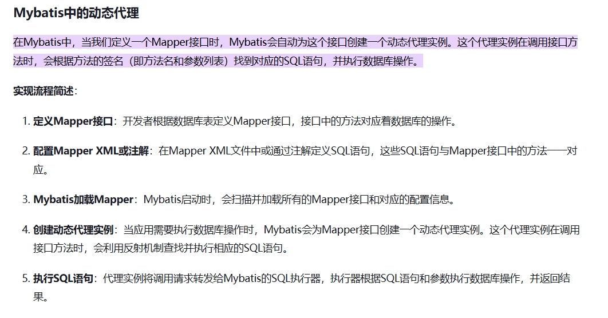

1. 红黑树和AVL 都是自平衡的二叉搜索树，红黑树没有平衡因子，所以不是严格平衡的，它通过五个特性达到一种近乎平衡的程度。叶子节点都是黑，根节点都是黑，节点不是黑就是红，任意节点到其叶子节点的黑色节点数量一样，从根节点到叶子节点，不存在连续两个红。红黑树因为不需要严格的平衡，所以他旋转的次数会小于avl，整体效率会更高。hashmap就用了红黑树，当链表长度大于8，且数组长度大于64（初始长度16），链表会转红黑树。
2. 为什么hashmap的长度是2的幂次，因为对长度取模难度更低。可以优化成与操作，更快。
3. TreeMap TreeSet
4. 布隆过滤器 超大的二进制数组+多个无偏hash函数组成。一个输入值通过多个无偏hash函数映射再取模后，得到二进制数组的多个索引，如果对应索引的值都为1，那么可能存在，也可能不存在。但是只要，有一个不为1，那就肯定不存在。起到一个过滤作用
5. java有哪些锁？ReetrantLock sychronized
6. IO BIO NIO AIO 同步阻塞IO 同步非阻塞IO 多路复用IO 

BIO 同步阻塞IO

NIO 是一种面向缓存的，使用了通道和选择器，实现的一种IO多路复用模型，他是非阻塞的，通过selector进行select epoll调用查询资源是否就绪，然后再阻塞读取，可以高效的处理大量并发连接。

NIO提供了一种基于缓冲区和通道的I/O处理方式，相较于传统的流式I/O（BIO），NIO支持非阻塞I/O操作，可以更高效地处理大量的并发连接。buffered channel selector（选择select或者epoll实现高效的IO多路复用）

AIO，进一步的，AIO是异步的，因为她是异步读取资源，由内核态直接把资源准备好。

7. select poll epoll。文件描述符
8. java虚拟机内存分布。程序计数器：存储当前线程所执行的字节码的行号计数器。java虚拟机栈：局部变量表，操作数栈、方法出口、动态链接等信息。本地方法栈：服务于Native修饰的方法。堆，对象实例。方法区：元空间，静态变量、常量、类信息。
9. 创建类的方法。new 序列化 clone 反射（Class.newInstance 无参构造器，getConstructor.newInstance 有参构造器）
10. 反射如何获取class类？一般用Class.forName(“全限定名”), 或者 new Car().getClass()，或者 Car.class
11. 如何获取属性 getDeclaredField("名字")  getDeclaredFileds() 返回 Filed[] 。可以用过 setAccessible 设置私有属性可访问
12. 获取方法一样的  getMethods   getDeclaredMethods  setAccessible
13. method.invoke  field.set   field.get  -->   我已经是反射的高手了，哈哈
14. 上述方法好像没办法获取父类的（getField可以获取父类和子类的public，getDeclaredFileds只能获取子类的所有声明属性），不过有个FieldUtils，可以获取all
15. todo使用redis存储管理gpu资源。
16. 你的项目里使用了哪些设计模式。
17. 你有用到AOP吗？面向切片编程，基于代理实现的，使用AOP，我们可以在代码的上下文，或者是异常点插入代码，实现业务核心代码和辅助代码的解耦。像日志管理、事务、或者说全局异常统一处理、还有部分注解，这些都用到了AOP。
18. 有用到事务吗？事务的传播。

| 名字         | 存在                                                                           | 不存在                 |
| ------------ | ------------------------------------------------------------------------------ | ---------------------- |
| requires     | 加入                                                                           | 创建新事务             |
| supports     | 加入                                                                           | 就不存在，以非事务运行 |
| mandatory    | 加入                                                                           | 报错                   |
| requires new | 挂起，创建新的                                                                 | 创建新的               |
| not support  | 挂起，非事务运行                                                               | 非事务运行             |
| never        | 报错                                                                           | 非事务运行             |
| nested       | 创建一个新的，嵌套进去，作为子事务，自己的错不会影响外面的，外面的会影响自己的 | 创建一个新的           |

14. 设计模式，用到了哪些设计模式
15. AQS锁的具体过程 一个线程尝试去获取一个资源，如果该资源是空闲的，那么他会把这个线程给置为工作线程，并且把资源锁定。如果资源被锁定了，那么他会将该线程阻塞起来，直到资源释放后唤醒该线程。具体来讲，AQS（抽象队列同步器）通过state和阻塞队列（CLH队列）实现，通过不断CAS重试设置state获取锁。
16. CLH锁其实就是一种基于逻辑队列非线程饥饿的一种自旋公平锁。当多线程竞争一把锁时，获取不到锁的线程，会排队进入CLH队列的队尾，然后自旋等待，直到其前驱线程释放锁。https://blog.csdn.net/fengyuyeguirenenen/article/details/123856507
17. spring bean 的生命周期
18. threadlocal的原理
19. session和cookie的区别 session存于服务端，一般用来存储用户的登录信息等等，且没有最大内存限制。cookie存在于客户端，一般用于存储用户的偏好，或者用户信息，最大上限为4k。
20. 三色标记法。cms是基于标记清除算法的，这里的标记算法就是三色标记法（G1也是用这个），三色标记法是一种可达性算法。
21. java虚拟机内存模型 线程独有 虚拟机栈（局部变量表。。。）、本地方法栈（native修饰的方法，不是用Java实现的）、程序计数器（程序执行机器码的行数）。线程共享的有 堆（字符串常量池（这是个例外，在老年代，其他的在元空间）、Eden、S1、S2、老年代）、方法区（元空间：类信息、常量、静态变量）
22. 有哪些线程安全的集合 ConcurrentHashMap、WriteOnCopyArrayList
23. hashmap为什么是线程不安全的 没有任何应对多线程的措施，当 多线程并发添加元素时，如果发生hash碰撞，容易导致元素丢失。1.7以前因为头插法，还会导致循环问题。
24. ip可以传播信息，为什么还要tcp？（tcp保证了连接的有效性，超时重传。。。）
25. sql里的having
26. 对象创建的过程 类加载查询 分配内存（指针碰撞 内存队列，cas+错误重试、eden分配一个大的内存） 初始值0 对象头（包括元数据、GC、哈希码） 执行构造函数
27. Object的11个方法 hashcode tostring clone wait wait wait notify notifyall finalize equals getClass!
28. 为什么不用UUID做MYSQL主键 --> 不是有序的，会导致页分裂，树裂变问题。为什么不用雪花算法 --> 有序递增 唯一，但是有时钟回拨问题，要小心。分布式为什么不用自增主键，服务器同步消耗资源。 [参考连接](https://www.bilibili.com/video/BV1tx4y1s7Sd/?buvid=XY1FD0E11608521D4F0EDD39DFADF4E67F559&from_spmid=tm.recommend.0.0&is_story_h5=false&mid=MEfEQV3r8A8D9wFLkkEQYw%3D%3D&p=1&plat_id=116&share_from=ugc&share_medium=android&share_plat=android&share_session_id=355bbaf3-2e6a-4118-aec9-4366747feb94&share_source=WEIXIN&share_tag=s_i&spmid=united.player-video-detail.0.0&timestamp=1723629119&unique_k=XF9X1wt&up_id=1895753405)
29. 进程间通信的方式 管道 信号量 共享内存区 消息队列 socket 信号
30. 部署socket 服务端 打开网络库 创建socket 绑定端口和Ip 监听 接受连接 socket bind listen accept read/write
31. 客户端呢 打开网络库，创建socket 连接服务器
32. RESTFUL风格，一种软件架构风格，简单来说，URL里只有名词来定位资源，使用HTTP协议的动词（DELETE GET PUT PATCH）来实现资源的增删改查。[参考链接](https://blog.csdn.net/SeniorShen/article/details/111591122)
33. 幂等性是一个数学和计算机科学中的基本概念，主要应用于抽象代数领域。在编程中，一个幂等操作的特点是其任意多次执行所产生的影响均与一次执行的影响相同。这意味着无论一个操作被执行多少次，其结果始终保持不变
34. redis 如何创建分布式锁？
35. redisson用什么依赖？
36. 如何使用redis构造消息队列？
37. get和post的区别 get把参数放在请求行里（所以有长度限制），post把参数放在请求体里。get只做查询，post用于修改。post不是幂等的，get是。get可以被缓存，post不行
38. 并行GC和并发GC
39. CMS [CMS并发收集器](https://cloud.tencent.com/developer/article/2397939)
40. G1收集器 1024个region，每个region最大32MB。会选垃圾多的先进行回收，但是呢，他还是要标记整理，还是浪费时间 [写的很好](https://segmentfault.com/a/1190000039411521)  [理解G1垃圾收集器](https://blog.csdn.net/wanghang96/article/details/109731479)
41. G1收集器 完全年轻代回收 和普通的一样，从一个region复制到另一个region，就是复制算法。而且是STW的，上面两个链接都有说到这件事情。[这里也有](https://cloud.tencent.com/developer/article/1824886)
42. G1收集器 混合回收 回收年轻代+老年代，初次标记（STW）、并发标记、根区域扫描Rset、最终标记（STW）、回收（STW） [kan](https://www.jianshu.com/p/0b978e57d430) 为什么要跟区域扫描？为什么其他gc没有这种问题？我认为主要原因是，G1是分region清理的，而不是整块堆一起清理的[看这个](https://cloud.tencent.com/developer/article/1824880)
43. 哪些可以做为root?
44. 什么是增量回收? 不是一次把垃圾都回收完，而是递进的回收。
45. 什么是三色标记法 没访问到白色 访问到了灰色 访问到直接子节点了黑色 错判（写屏障+快照 写屏障+增量更新） 漏判 [参考链接](https://blog.csdn.net/star1210644725/article/details/115712443)
46. 锁升级 偏向锁（一个线程） 轻锁（两个，CAS） 重锁（多个，互斥）
47. 有哪些常见的starter
48. reddsion如何实现阻塞队列 reddsion实现了blockingQueue，实现了juc包里的blockingqueue接口，本质还是List数据结构
49. 有哪些线程安全的集合？concurrentHashMap （Node 链表+红黑树 CAS + sychronized）CopyOnWriteArrayList blockingQueue
50. netty 封装了NIO，超牛逼的网络编程框架 [netty](https://cloud.tencent.com/developer/article/1748761)
51. Err和exception，err是没法解决的异常，java虚拟机出错了，出现这个一般会直接停止程序。exception是可以捕获的。
52. 受检查异常、非检查异常（runtimeException及其子类，例如空指针异常或者数组越界之类的，不需要用户throws或者try catch的）
53. 有几个拒绝策略？abort（抛出异常） caller discard discardoldest
54. 自动装配流程？
55. spring boot项目的创建流程？
56. 什么情况下会oom？
57. 用了什么设计模式？你知道哪些设计模式？单例、观察者
58. 最小生成树是什么？
59. java多线程是用户线程吗？（不是的）
60. 线程数多少合适？
61. netty的应用（Spring Cloud gateway和redisson）
62. JWT的消息存在哪里？redis
63. JWT分为几个部分？3个64位
64. header里的authorization （token放的位置）
65. 哪些用了单例模式？GPU资源管理（因为GPU资源在服务器上数量肯定是固定的嘛，所以创建了一个单例的类去管理他），连接池、单例的spring bean（默认的）。适配器模式：数据集的格式很多，gdsx、h5、csv、甚至他们还把数据附着在请求体里，因为一开始定下的是h5格式的，所以一开始也只写了h5格式的接口，后面为了解决数据集格式不同的问题，中间加了一个转换层，对不同格式的数据集统一转换成h5格式，这样就能兼容以前写的接口了。建造者模式：用户通过自定义的具体配置（模型参数、训练参数），指挥创建对应的任务实例（包括工作空间）。模板方法：没有用在java里，写python训练代码的时候用的，像我们做深度学习训练或者预测的时候，整体的流程是固定的，创建模型、加载数据、加载到GPU里，创建优化器、创建学习率优化器，然后开始训练/预测，然后做训练，训练过程中还要进程日志记录。不同任务类别，细节处可能不一样，但是大致的流程是差不多的，我针对测井任务写了一个整体流程模板给我们实验室用，他们训练的时候自己调用钩子函数，或者重写stepRunner或者epochRunner就可以实现自定义训练+观测。
66. 观察者模式 spring 事务，java io，nio也用了观察者吧？
67. 如何创建线程池的starter？
68. 线程池：放线程的一个池子，是为了减少频繁的创建线程和销毁线程带来的性能损耗。
69. 线程池 shutdown和shutdownNow。前者是没执行的直接干掉，正在执行的正常。后者没执行的关掉，正在执行的发送interrupt指令。
70. 有哪些springboot starter? mybatis redisson redisdata springbootcloud mybatisplus web parent
71. 遇到过哪些问题？openfeign调用丢失头、读取输出死锁问题（如何检测死锁，https://blog.csdn.net/qq_34680444/article/details/109642653）、如何访问指定的IP、数据集标签返回的特别慢
72. 内存没有释放掉的原因（生命周期不合理、单例模式引用、静态变量引用、常量引用）
73. 触发 full gc 的前提条件 老年代区域不够、元空间区域不够
74. spring bean的作用域 单例 singleton prototype request session application websocket
75. spring bean的生命周期？实例化 依赖注入 初始化（myInit） 使用bean 销毁bean
76. 多线程处理数据集。。。
77. 建造者模式和工厂模式的区别
78. 对修改关闭，对扩展开放
79. 对象的创建过程 类加载检查 --> 分配内存（指针碰撞，空闲列表，线程本地分配缓存TLAB + CAS） --> 初始化零值 --> 设置对象头（哈希码，GC分代年龄） --> 执行init方法
80. 加载 验证 准备 解析 初始化 使用 卸载
81. jconsole，慢sql问题
82. 类加载器，加载Java类字节码到JVM中，在内存中生成类的Class对象（用到再加载，就跟那啥一样的嘛，类加载检查）
81. 双亲委派，子加载器再接受到类加载请求时，会把这个请求传递给父加载器，如果父加载器无法加载，他才会自己去尝试加载。确保类不会被重复加载。确保了类的唯一性，以及核心API不被篡改
82. Spring bean的创建过程，生命周期，实例化，依赖注入，初始化，使用，销毁
83. Spring boot 自动装配注解，什么是自动装配？
84. jps
85. 看一下mysql和redis+集群
86. 看一下Spring springboot spring cloud
87. @Component 和 @Bean 的区别是什么？@Component 注解作用于类，而@Bean注解作用于方法。@Component通常是通过类路径扫描来自动侦测以及自动装配到 Spring 容器中（我们可以使用 @ComponentScan 注解定义要扫描的路径从中找出标识了需要装配的类自动装配到 Spring 的 bean 容器中）。@Bean 注解通常是我们在标有该注解的方法中定义产生这个 bean,@Bean告诉了 Spring 这是某个类的实例，当我需要用它的时候还给我。@Bean 注解比 @Component 注解的自定义性更强，而且很多地方我们只能通过 @Bean 注解来注册 bean。比如当我们引用第三方库中的类需要装配到 Spring容器时，则只能通过 @Bean来实现。
88. @Autowired （Qualifier）和 @Resource 的区别是什么？
89. spring循环依赖 三级缓存。三级缓存只对单例Bean有效：多例Bean无法利用三级缓存解决循环依赖。构造器循环依赖无法解决：构造器循环依赖发生在Bean实例化阶段，此时连早期对象都还未创建，无法放入三级缓存。构造器在实例化的过程中
90. @lazy，懒加载，就是不会立即初始化他，只有在使用的时候才回去使用它。
91. jvm线程状态: NEW, RUNNABLE, BLOCKED, WAITING, TIMED_WAITING, TERMINATED。
92. 原子性。要么都成功，要么都不成功
93. TCP拥塞控制，4种
94. URL输入全过程。首先解析域名 缓存查询，hosts文件查询，询问本地DNS服务器，本地DNS服务器找不到上顶级域名，找不到上根域名。找到了就打包发送。细节忘了
95. INCR也可以做分布式锁
96. 数据结构中，Stack是一种先入后出的数据结构，堆的话是一种特殊的完全二叉树，根节点最大或者最小
97. 内存分配中。栈由操作系统自动分配释放 ，用于存放函数的参数值、局部变量等，分配效率会高一点。堆由开发人员分配和释放，生长方向向上
98. spring boot 缺点，依赖冲突，性能不高。
99. IO多路复用（Input/Output Multiplexing）是一种在单个线程中管理多个输入/输出通道的技术。它允许一个线程同时监听多个输入流（例如网络套接字、文件描述符等），并在有数据可读或可写时进行相应的处理，而不需要为每个通道创建一个独立的线程。
100. 跳表，基于单链表的一种数据结构。通过构造一级索引、二级索引，构建不同的层级。最往上，他的跳跃幅度就越大，最下面一层的话啊就是一个单链表。实现了logn级别的查询时间复杂度。
101. spring 三级缓存
102. FixedThreadPool（固定大小线程池） CachedThreadPool（缓存线程池） SingleThreadExecutor（单线程线程池） ScheduledThreadPool（定时线程池）
103. redis高可用 主从复制 哨兵 集群
104. concurrentHashMap concurrentLinkedQueue CopyOnWriteArrayList BlockingQueue
105. 反射的原理 加载字节码，创建Class类，调用相关方法去访问
106. final方法无法被重写
107. 静态代理。写一个接口，被代理类和代理类都实现这个接口。这样子两者就有了相同的方法，代理类就可以在对应的方法里调用被代理类的对应方法，并做扩展。或者代理类直接继承被代理类也行。  https://blog.csdn.net/wufaliang003/article/details/79305688
108. jdk proxy动态代理的原理。首先我们要创建一个invocation类，这个类需要实现invocationHandler接口。并且这个类里面应该包含被代理对象，也就是说被代理对象该invocation对象的一个私有属性。然后我们需要重写invoke方法，在invoke方法里通过反射调用被代理对象的方法（method.invoke），并实现上下文的扩展。随后呢，我们需要获取一个代理对象。通过Proxy.newProxyInstance获取，这个方法呢有三个参数，分别是类加载器、接口列表以及前面我们写的invocation对象。这个创建的过程是这样的，里面有个方法叫getProxyClass0的方法，这个方法接受类加载器和接口列表，创建一个实现了接口列表的类的Class对象。随后通过调用class.getConstruct().newInstance()方法，创建出来了一个代理类。那么这个代理类的核心思想，就是通过invocationHandler进行回调，你调用了代理的某个方式，实际上就是通过反射，被代理类中该方法的一个method对象，然后传递到invocation对象的invoke方法里。https://blog.csdn.net/zxysshgood/article/details/78684229
109. jdk proxy 为什么一定要继承proxy对象，我更倾向于这是一种设计规范，因为我们proxy类和我们的代理对象的唯一交集就是invocation这个对象嘛，我们完全可以把这个对象直接拿到被代理对象里，我感觉他就是不想你通过继承去实现代理类，因为这样子代理类里可能会有一些被代理类的属性，而这是完全没有必要的。另外，final修饰的方法无法重写，也就无法代理。  https://www.zhihu.com/question/62201338
110. CGLIB怎么实现的？自定义拦截器和回调过滤器。动态的生成字节码，生成被代理对象的子类。
111. DI 动态代理 java反射 mybatis，反正需要动态获取属性或者修改对象的，都得用反射  https://blog.csdn.net/weixin_41793160/article/details/137275540
112. mybatis咋实现的，一个xml文件对应一个dao层的接口，接口的全限定名就是xml文件里的命名空间，全限定名加上方法名，就能唯一定位xml文件里的MappedStatement，本质还是jdbc。https://blog.csdn.net/weixin_44495678/article/details/106748214
113. mybatis代理的流程。定义mybatis接口 --> 编写对应的xml文件，接口里的全限定名对应xml里的命名空间。 --> mybatis创建代理实例并注入IOC容器（代理容器里面和jdbc那一套一样的，获取sql，进行查询，如果分页的话，其实就是拦截器捕获sql语句，并且在最后加上limit操作） --> 用户通过代理实例进行sql操作   https://developer.baidu.com/article/details/3323495 
114. mybatis很好的支持springboot，大量减少了代码量，并且sql语句和实际业务分离，降低耦合，支持动态sql语句。缺点是调试比较复杂，并且sql语句对数据库依赖比较严重。
115. mybatis-plus，对比mybatis，内置通用 Mapper、通用 Service，我们就可以不用写sql语句了，直接面向对象编程，可以直接用Query Wrapper完成增删改查，内置分页插件。简化开发。维护性差：以查询为例，默认提供的方法都是查询所有字段，我们都知道在编写Sql的时候第一条优化准则就是不要使用Select * 因为这种写法是很Low。侵入性太强，表的相关信息会以硬编码的形式写到dao层里去。而且复杂查询会很难看的。
116. jdbc加载驱动，建立连接，获取statement对象，执行sql语句
117. 为什么等待2MSL 确保网络中的所有FIN都没了，1MSL 30s 1分钟 2分钟都有。一个报文从发送到接受，最多1MSL，一来一回刚好是2MSL，比较充裕。
118. 进程状态： 创建 --> (运行 就绪 阻塞) --> 结束 https://xiaolincoding.com/os/4_process/process_base.html#%E8%BF%9B%E7%A8%8B%E7%9A%84%E7%8A%B6%E6%80%81
119. java 线程状态: java.lang.Thread.State中定义了6种：初始(new) 运行(runnable) 阻塞(blocked) 等待(waiting) 超时等待(timed_waiting) 终止(terminated)
120. 僵尸进程：子进程已经结束了，但是父进程不知道，所以子进程PCB还留在系统中
121. 孤儿进程：父进程已经不存在了，但是该进程仍在运行。
122. 双亲委派，一个类加载器加载类的时候，不会自己去加载，而是会先让父类加载器去加载，如果父类加载器失败了，他才会自己尝试加载。
123. volatile，保证了变量的可见性，这个变量在所有线程中都是可见的。写一个volatile变量的时候，会强制更新到主内存，并使其他线程缓存无效。禁止指令重排序。
124. 什么是依赖注入。是一种设计模式，降低了对象之间的耦合性，像IOC就是靠DI实现的。三种方式 field注入 构造函数注入 setter注入
125. 进程：进程是操作系统进行资源分配的基本单位，正在运行的一个程序实例，一个进程可以多个线程，并且进程和进程之间几乎是独立的。
126. 线程：线程是操作系统进行调度的基本单位，线程和线程之间可以访问同一个资源，并且相互影响，每个线程有自己的程序计数器、虚拟机栈、本地方法栈，并且共用堆和方法区。
127. 进程和线程的区别是是否单独占有内存地址空间及其它系统资源（比如 I/O）。进程是操作系统进行资源分配的基本单位，而线程是操作系统进行调度的基本单位。
128. 协程：更轻量级的，由用户控制的，避免了线程上下文切换的消耗。协程并没有增加线程数量，只是在线程的基础之上通过类似时分复用的方式运行多个协程。
129. 信号量，可以由多个线程获得的锁。是不是可以这么理解？
130. RouteToRequestUrlFilter 结合请求url和route对象里的URI，生成一个真正往后端服务的请求，那我只要在这里手动的把URI替换成我想要的就行了，完全没影响。https://blog.csdn.net/qq_43437874/article/details/121620256
131. Spring Boot 旨在简化 Spring 开发，就像是一个脚手架一样，内置了服务器，我们通过自动装配，约定大于配置，可以方便的构建spring服务，开箱即用。
132. 一级缓存 存放最终形态的bean（是一个单例池），二级缓存 存放半成品，三级缓存存放objectfactory。A->B->A，b会去三级缓存里创建一个前期暴露对象。
133. 依赖注入的注解？
134. bean和component，bean往往和configuration一起用，用在方法上，显示的获取某个bean。component是直接作用在类上的。
135. 输入url后的完整流程。通过DNS解析域名对应的ip。把HTTP 的传输工作交给协议栈。TCP连接完成之后，生成TCP报文。交给网络层，也就是IP协议，封装成网络包，加上MAC头部后传输数据。服务器拿到了数据包之后，层层解析，再返回给客户端，客户端解析完后交给浏览器去渲染页面。
136. 进程调度策略。时间片轮转，优先级调度，先来先服务调度，短作业优先
137. 如何查看linux里的日志。cat 配合 grep 大概吧
138. minio 直传、分片、断点、秒传
139. AOP的原理，如何实现？Log如何实现？看看若依的实现。
140. 项目的难点在哪》》》？？？
141. 框架就是注解+反射+设计模式
142. 元注解 对现有注解做注解的注解 @Target（这个注解能放在哪些前面） @Retention @Document @Inherited（该注解能否被继承）
143. source（override） class（lombok getter setter） runtime（AOP）
144. Document 生成文档时，是否包括该注解（被Document修饰的那个注解）？
145. 多态是指允许不同子类型的对象对同一行为作出不同的响应。比如父类的引用指向子类的实例。方法重载（overload）实现的是编译时的多态性（也称为前绑定），而方法重写（override）实现的是运行时的多态性（也称为后绑定）。多态是指同一个接口或父类引用变量可以指向不同的对象实例，并根据实际指向的对象类型执行相应的方法。
146. 场景题：美团外卖每天高峰时间及非高峰时间线程数设置，怎么动态修改
147. 哪些对象可以作为GC Root。虚拟机栈里的局部变量表。方法区里的静态变量、常量。native方法引用对象。被同步锁持有的对象。
148. **两阶段提交。**为什么要两阶段呢？直接判断binlog不就好了吗。~~因为commit后不能回滚。你就算是发现了binlog不完整，你也不能回滚了，因为你已经commit了。就这么简单。~~ 引擎设计的目的就是redolog提交后相当于事务完成了吧。
149. redolog和binlog的区别，一定要搞清楚！！！https://cloud.tencent.com/developer/article/1965127 这个链接讲的很清楚
150. redolog，再更新数据库的时候，会先把东西写到bufferpool，也就是缓存里，然后再找机会同步到磁盘，那么内存是不可靠的，比如机器突然宕机了，那内存里的东西不久全丢了？所以需要redolog，把bufferpool里做的修改给记录下来。先缓存再写入。redolog只记录对某个数据页做了什么修改，而且还是顺序写入。对比直接写入到磁盘里，速度大大提升。这就是redolog，记录了已经写入到bufferpool但是还没有刷盘到磁盘里的东西。保证了mysql的持久性。redolog会有一个头和尾，头表示还没刷入磁盘的最早的改动，尾表示最新的改动
151. binlog记录了用户的写入操作，作用于server层。binlog是什么呢， binlog记录了用户写入了什么，他把用户做的每一个写操作都记录下来了。是用于归档的，主从复制的，没有故障恢复的功能。为什么没有？因为binlog记录了所有东西，没刷盘的记了，刷盘的也记了。同时他回滚也慢啊，都是sql语句，还要解析，不如物理日志来的快。而且这是一个异步的操作，binlog上有的，不一定就是落盘了的，他可能就还在缓存里。 https://www.zhihu.com/question/463438061?write
152. buffer pool是什么？这个mysql读写啊，不是直接操控磁盘的，他会读取一些页放在buffer pool里，写的时候直接改buffer pool，并且将指定的页变为脏页，后面统一刷盘到磁盘。
153. redis读写分离。
154. 惰性删除（发现删）和定期删除（定期扫描一批删除）
155. explain。id 该条查询的具体id；table：查询的表；select_type：查询类别simple就是简单查询 primary就是包含了复杂的子部分；type：查询类型，all，index，range，ref，eq_ref，const；possible_key和key，可能用到的索引和实际用到的索引；key_len：索引字节数；rows：大致行数
156. springboot starter，是一组便捷的依赖描述符，预先打包了库和配置，我们开发的时候，只需要添加starter依赖，就可以自动引入库和配置了，方便的很。
157. 有哪些starter，spring-boot-starter, spring-boot-starter-parent, spring-boot-starter-web, spring-boot-starter-security, spring-boot-starter-test, spring-boot-starter-actuator, spring-boot-starter-aop, spring-boot-starter-validation, spring-boot-starter-data-redis, redisson-spring-boot-starter, spring-boot-starter-jdbc, mybatis-plus-boot-starter, spring-boot-starter-tomcat, spring-boot-starter-jetty
158. springboot application 主要由三个组成 configuration, conponentScan, EnableAutoConfiguration
159. configuration, 允许上下文中注册额外的bean或导入其他配置类
160. componentScan，自动扫描项目里的bean 
161. enableautoconfiguration，启动springboot自动配置机制，autoconfigurationImportSelector的getCandidateConfigurations方法加载所有可用的配置类，并以list的形式返回，有spring容器管理。
162. 最后，简单总结一下:Spring Boot 的自动配置机制通过 @EnableAutoConfiguration 启动。该注解利用@Import注解导入了AutoConfigurationImportSelector类，而 AutoConfigurationImportSelector 类则负责加载并管理所有的自动配置类。这些自动配置类通常在 META-INF/spring.factories 文件中声明，并根据项目的依赖和配置条件，通过条件注解(如 @conditionalOnClass、@ConditionalOnBean 等)判断是否应该生效。
163. 加载优先级 bootstrap.properties > bootstrap.yml > application.properties > application.yml
164. bootstrap一般用于系统配置，比如nacos信息，一般不会变动。application一般作为用户配置，会变动的。
165. 如何读取配置信息，@value，@ConfigurationProperties，@propertySource
166. beanutils是常见的bean映射工具，用的是apache
167. 做参数校验，用的是spring boot starter web 里自带的hibbert... 只要加上一个@Validated(组)即可。或者直接加载类前面，参数前面再加上验证注解。
168. @Valid和@Validated的区别，主要就在于，@Valid可以放在成员变量前面，所以它可以实现嵌套注解。
169. ControllerAdvice和ExceptionHandler实现统一异常处理
170. restControllerAdvice相比没有rest的，就是加了个responseBody注解，把函数返回放到返回体里
171. @schedule很方便哦，并且还要加上enableScheduling注解
172. redisson\Spring Cloud gateway\dubbo\rocketMQ\ElasticSearch用netty实现
173. 什么是零拷贝？减少内核态用户态切换次数，减少数据拷贝次数。传统的是4次切换+4次拷贝。数据从磁盘拷入内核缓存->用户缓存->socket缓存->网卡。mmap，用户不用拷贝到用户态了，直接从内核态拷贝到socket，但是还是4此切换。sendfile只用调用一次，直接把数据从磁盘->内核缓存->socket->网卡，两次切换，三次拷贝。使用SG-DMA技术，可以直接磁盘->内核缓存->网卡。两次切换，两次拷贝。这就是零拷贝。
174. 对象访问定位的两种方式？句柄和直接指针，区别？句柄的话是引用存储对象的句柄地址，然后句柄里有对象实例地址和类信息地址。直接指针的话，引用就指向对象实例数据，然后实例数据里又有类信息的指针。
175. 你有遇到过GC问题吗？有GC调优的经验吗？todo
176. 线程池经验公式：CPU数 * CPU核心数 * CPU利用率 * (1+空闲时间/工作时间) https://cloud.tencent.com/developer/article/1832455
177. java分析工具 jconsole 和 jmeter
178. http1.1，长连接 管道传输（不用等到有返回就可以发送，但还是要按照顺序来）
179. https，加了SSL/TLS层，信息加密、校验机制、身份证书。混合加密、摘要算法、服务器公钥放入数字证书。
180. jmm java 内存模型 
181. 一个RTT即数据包来回的时间。超时重传时间 RTO 的值应该略大于报文往返 RTT 的值
182. tcp和udp可以绑定一个端口，会根据头部选择具体的协议。
183. 多个tcp服务也可以绑定一个端口，只要ip不一样。多个客户端也可以绑定一个端口，和服务端一样。
184. time_wait过多怎么办？长连接+打开服务器的SO_REUSEADDR（端口重利用，把处于time_wait状态的端口再用起来）
185. tcp协议的缺陷，建立连接存在延迟，会发生队头阻塞，网络进行迁移的时候会重建TCP连接（此时四元组发生了变化）
186. 程序计数器：程序计数器是一块较小的内存空间，可以看作是当前线程所执行的字节码的行号指示器
187. 虚拟机栈：局部变量表、操作数栈、动态链接（指向运行时常量池的方法引用，https://www.zhihu.com/question/48267791）、程序返回地址
188. 直接引用和符号引用，直接引用就是可以通过引用直接获取所需数据。符号引用就是有引用的对象的名称和相关信息。
189. 本地方法栈：和虚拟机栈一样，只不过是给native修饰的本地方法（不是用Java实现的方法）使用的
190. 堆：堆的唯一目的就是存放对象实例，几乎所有的对象实例以及数组都在这里分配内存
191. 方法区：1.8之后就是元空间。todo，这个没搞懂
192. 三个类加载器 启动类（BootStrap） 扩展类（Extension） 应用程序类（AppClass） 自定义加载器
193. 保证接口幂等性。uuid，分布式锁，数据库唯一索引，token
194. 手写双线程打印helloworld，手写单例懒汉模式。
195. synchronized和reentrantlock的区别。
196. synchronized 非公平锁、灵活度较差/颗粒度较大（自动加锁和释放，无法从阻塞中唤醒）、无法响应中断
197. reentrantlock 公平/非公平、锁颗粒度较小（可以通过Lock unlock自由获取释放）、基于CAS实现的、可以设置超时时间
198. 什么是匿名类？什么是内部类？什么是箭头函数？什么是lamdba表达式？
199. 内部类：类中类。
200. 匿名类：在实例化对象的时候，直接重写父类的方法。https://blog.csdn.net/cao124383050/article/details/102862120
201. lamdba和箭头函数和匿名函数：一个东西，简化代码的方法，变量 -> 代码块。可以实现只有一个方法的接口。https://blog.csdn.net/peterwanghao/article/details/103729038
202. sleep和wait，notify和notifyAll的区别。唤醒一个和唤醒多个
203. 注解和切面，可以把注解定义为一个切面（感觉变成了注解修饰的方法），多个注解可以用Order来规定顺序，参考同心圆，先执行的肯定最后退出。https://blog.csdn.net/hxpjava1/article/details/55504513
204. 幂等性：就是用户对于同一操作发起的一次请求或者多次请求的结果是一致的，不会因为多次点击而产生了副作用。
205. 用户态：线程执行用户自己的程序。不能直接使用系统资源、硬件资源，也不能改变CPU的工作状态，只能访问用户程序自己的内存空间。
206. 内核态：CPU可以执行所有的指令和访问所有的硬件资源。这种模式下的操作具有更高的权限，主要用于操作系统内核的运行。
207. select poll epoll 实现io多路复用的技术
208. select：最古老的IO复用技术，将连接放到文件描述符集合里，用户态调用select函数，将文件描述符集合拷贝到内核态，内核态遍历文件描述，查看连接是否就绪。然后将描述符拷贝回用户态，用户态再次遍历描述符集合，选择就绪的连接，进行操作。
209. poll：真名解放，领域展开，使用pollfd动态数组替换fd_set结构，没有文件描述符上限限制
210. epoll：终极升级，事件驱动，使用红黑树epoll对象维护需要监听的连接。主动将就绪的文件描述符添加到队列中。用户态只需要遍历已经就绪的文件描述符即可。
211. 单个进程打开文件描述的数量是1024，没做修改的话。
212. 文件IO https://xiaolincoding.com/os/6_file_system/file_system.html#%E6%96%87%E4%BB%B6-i-o
213. 阻塞 应用程序发起IO操作后，会阻塞等待IO操作完成才返回结果。阻塞IO，读取文件的时候，用户程序发起read，会等到内核数据准备好，并拷贝完，再返回。
214. 非阻塞 应用程序发起IO操作后，直接返回，不阻塞，但是需要不断轮询操作是否完成。非阻塞IO：无需等到内核数据准备好，而是轮询内核数据是否准备好了，好了再拷贝。
215. 同步。应用程序发起后直接执行。同步IO，文件读取过程中，数据从内核态拷贝到用户态这个过程需要等待。
216. 异步 应用程序发起操作时，不立即执行，而是安排一个以后的时间执行。异步IO：文件读取的时候，程序直接放在后台执行，等待IO准备就绪过程和内核态拷贝到用户态过程 均不会阻塞。  https://blog.csdn.net/wangpaiblog/article/details/117236684
217. IO多路复用，非阻塞同步IO，一个线程可以处理多个IO，或者说一个线程可以同时监听多个输入流。拷贝操作还是阻塞的（同步），前面的等待内核数据准备好这个过程时非阻塞的，可以同时监听多个IO。
218. Spring boot启动过程。1.找到SpringbootApplication的run方法；2.初始化SpringApplication，运行SpringApplication。详细内容看Springboot.md
219. 自动装配的原理。详细的看Springboot.md
220. ConfigurableApplicationContext 是什么啊？
221. ApplicationContext 是 BeanFactory 的一个子接口。beanFactory：一个工厂接口，负责生产和管理Bean
222. Spring上下文（就是上面那个）是Spring框架的核心部分之一，它是一个容器，负责管理应用程序中的对象（也称为Bean）。上下文在应用程序中充当了一个中央枢纽的角色，它负责创建、配置和管理Bean的生命周期。Spring上下文是Spring框架的核心部分之一，它是一个容器。surprise！ https://blog.csdn.net/diligent_man_z/article/details/136631508
223. META/INF 通过 SpringFactoriesLoader 加载
224. 什么是设计模式？软件开发过程中总结出的一套通用的代码设计方案。
225. 设计模式三大类：创建（单例、工厂、建造者） 结构（装饰、适配、组合、外观） 行为（观察者、模板、策略）
226. 建造者模式：
227. solid 单一职责 开闭原则 里氏替换 接口隔离 依赖倒置（依赖抽象而不是细节） 迪米特法则（最少知识）
228. 微服务是一种架构风格，将一个完整的服务拆分成多个独立的服务，可以部署到不同的服务器上。他的优点是，第一，模块化+耦合性低，将复杂的大型服务拆分成多个小服务，每个服务的开发和内部维护难度就会降低，也更有利于分工合作；第二，资源分配更加灵活，不同服务的部署数量由我们自己掌控；第三，可以独立部署，每个服务之间不会互相影响；第四，高可用性，可以应对高并发。第五，技术栈可以独立。说到底还是模块化、解耦、独立。
229. 缺点也很明显啊。每个服务之间通过网络来访问，加大了网络IO的负担，并且不稳定；我们需要更多的中间件确保系统的稳定性；整体调试相对困难；运维成本也高；工作量也大。https://developer.aliyun.com/article/1422670
230. 高可用=减少系统不能提供服务的时间
231. cookie和session的生命周期
232. Java 泛型（Generics） 是 JDK 5 中引入的一个新特性。使用泛型参数，可以增强代码的可读性以及稳定性。它允许类、接口和方法在定义时使用一个或多个类型参数，这些类型参数在使用时可以被指定为具体的类型。
233. Object是所有类的父类。对元素没有任何限制、需要进行强转。https://blog.csdn.net/Yangyeon_/article/details/131982161
234. Java面向对象，平台无关，自动GC。
235. 什么是反射，Java反射机制允许我们在运行过程中，动态的获取类的属性、方法，并修改对应的属性值或者是调用对应的方法。
236. TCP：面向连接，面向字节流，可靠的，点对点，报文首部20，一系列保证可靠的机制如拥塞控制、流量控制、连接管理
237. UDP：无连接，面向报文，一对一，一对多，多对多，首部8，快，但不可靠。
238. 雪花算法，64个bit，第一个bit没用的，中间41个bit是时间戳，10个bit是机器号，还剩8个bit是序列号。
239. 垃圾回收机制的评价标准。最大吞吐量和最小暂停时间。
240. 消息队列如何确保消息不丢失。生产者到消息队列：事务、确认机制。消息队列本身：持久化、集群。RabbitMQ到消费者：basicAck机制、死信队列、消息补偿机制。
241. 什么是红锁。红锁采用主节点过半机制，即获取锁或者释放锁成功的标志为：在过半的节点上操作成功
242. 旁路 读穿 写穿 写回
243. 每个层有哪些协议？
244. 应用层 传输层 网络层 网络接口层
245. 应用层 传输层 网络层 数据链路层 物理层
246. 应用层 表示层 会话层 传输层 网络层 物理层
247. 应用层 为计算机用户提供服务
248. 表示层 数据加密压缩
249. 会话层 管理用户之间的会话
250. 传输层 在两台终端之间提供传输服务
251. 网络层 路由和寻址
252. 数据链路层 帧编码和误差纠正控制
253. 物理层 透明的传输比特流
254. ARP协议就是通过IP地址获取具体的MAC地址。先查自己的ARP表；再发送一个广播报文，目的主机收到报文后，返回自己的MAC地址，将其放入ARP表中。
255. ICMP（Internet Control Message Protocol，互联网控制报文协议）：一种用于传输网络状态和错误消息的协议，常用于网络诊断和故障排除
256. NAT（Network Address Translation，网络地址转换协议）：NAT 协议的应用场景如同它的名称——网络地址转换。
257. SSL/TLS四次握手。1. Client Hello 客户端第一次生成的随机数、TLS版本号、加密套件列表。2. Server Hello 随机数 TLS版本号 加密套件。Server Certificate 服务器数字证书 Server Hello Done 表示第二次握手完成。3. 客户端解析数字证书，得到公钥，加密第二次生成的随机数。给服务端发送三个东西：加密后的随机数、加密通信算法更改通知、之前的摘要信息。4. 服务端也生成会话密钥、并给客户端发送一个加密算法更改通知。四次握手结束，后面都用会话密钥进行对称加密。
258. 模块化：每个模块独立，易于维护和扩展。独立部署：每个模块可以独立部署，不影响到其他的模块。低耦合，每个服务有自己独立的数据存储，避免因为一个服务的故障，导致整个服务无法使用。高可用，每个服务可以水平扩展，我们可以针对每个服务具体的需求，添加实例数量。不同服务可以用不同的代码来实现。
259. CA证书如何解析
260. 微服务的特点。独立部署、低耦合、模块化：微服务把原来单体式服务的多个模块拆分成多个子服务。每个子服务都可以单独部署，互不影响，比如说，这个服务可以部署在本地，那个服务可以部署在虚拟机，另外一个服务可以部署在docker容器里，降低了服务内部开发、扩展和维护的难度。高可用，高并发性：如果某个服务挂掉了，他不会影响到整个服务的运行，同时每个服务可以进行水平扩展，我们可以根据实际生产需要，加大某个服务的实例，以应对高流量高并发。技术多样性：每个服务可以用不同的语言来实现，java go python 都可以。
261. java 代理 or 代理模式。我们在访问一个对象的时候，不是直接去访问这个对象，而是通过代理简介的去访问这个对象，这样做的好处就是，我们可以在不对原有代码做修改的前提下，扩展类的功能。
262. jvm一个进程CPU占用特别高，为什么？CAS自旋锁不断尝试获取资源，jconsole查看线程数。死循环/大量递归（检查代码）。内存泄漏（检查堆的使用量）。
263. from>where>group（含聚合）>having>order>select。having只能用于select https://blog.csdn.net/qq_44034384/article/details/106006863
264. mysql主从复制？
265. redis高可用性如何保证？
266. 旁路：先写再删，延迟双删
267. 读写穿透：直接和缓存打交道，不管数据库了。读，直接读缓存，如果没有缓存直接从数据库读。写，直接写缓存，缓存自己向数据库更新。
268. 写回：和读写穿透差不多，但是他的写只会写入缓存，然后由异步的方式更新到数据库。canal和消息队列？
269. 两阶段提交。增加了一个TC，事务协调者。在真正的提交操作前，增加了一个准备阶段，收集业务是否准备完毕的状态，即是否有能力提交任务。如果业务返回yes，不管发生什么事情，该业务都必须确保一定能提交。https://blog.csdn.net/lengxiao1993/article/details/88290514
270. mysql存IP， INET_ATON()：把 ip 转为无符号整型 (4-8 位)，INET_NTOA() :把整型的 ip 转为地址
271. MySQL调优，其实就是问你索引，如何让索引生效。尽可能的提高 key 的等级。
272. MySQL读写分离。部署多台服务器，主服务器同步数据到从服务器（主从复制），系统将写请求交给主服务器，读请求交给从服务器。
273. 读写分离实现。通过加一个代理层，mysql proxy mysql router 进行负载均衡
274. 主从复制。主节点把物理日志写入binlog。从库连接主库。从库创建一个IO线程请求同步。主库创建一个IO dump线程向从库发送数据。从库将binlog的内容写入relay log。从库解析relay log。[都是从这里来的](https://javaguide.cn/high-performance/read-and-write-separation-and-library-subtable.html#%E4%B8%BB%E4%BB%8E%E5%A4%8D%E5%88%B6%E5%8E%9F%E7%90%86%E6%98%AF%E4%BB%80%E4%B9%88)
275. 解决主从之间的数据延迟问题。当写特别多或者从库执行relay log速度比较慢会发生-->主库写入太多、从库太多、网络延迟、从库性能太差、从库有大量读操作。强制从主库读取，延迟读取。
276. 分库。数据库的表分散到不同的数据库上。垂直：比如用户表、订单表变成用户数据库、订单数据库。水平：把用户表的不同id，分到不同的数据库里去。
277. 分表。数据库的表拆成多个表。垂直：不同的字段拆成多个表。水平：不同的id范围拆了。
278. 什么时候分库分表。表实在是太大了。查询起来特别慢，可以分表。数据库太大了，备份数据库的时间太长。
279. 三大范式？确保数据库中的每个列都是原子性的，即每个列都不可再分。在满足第一范式的基础上，确保数据库中的每个非主键列完全依赖于主键。在满足第二范式的基础上，确保数据库中的每个非主键列都不传递依赖于主键。https://blog.csdn.net/ddzzz_/article/details/119277573
280. 主键-->只能有一个，但是可以有联合主键
281. 模糊匹配一定会失效嘛？当然不会，一般情况下 like %??? 会失效，但是，如果查询的内容可以通过覆盖索引来获取，数据库的type就会使index，也就是遍历索引树，进行覆盖索引。https://xiaolincoding.com/mysql/index/index_issue.html#%E9%A2%98%E7%9B%AE%E4%BA%8C
282. 为什么有非主键他就不会选择index，而是选择all呢。因为二级索引扫描完之后，他还要去回表，太麻烦了。
283. 为什么要满足最左匹配原则呢。
284. 序列化。自己用反射写，有点搞笑。gson存在的子类父类属性同名的问题。https://blog.csdn.net/aaaassss602/article/details/122997405。其实这样做不和规范的。。。
285. spring cache？不用
286. 用spring boot starter data redis (lettuce + spring data redis)
287. 序列化用的是什么？spring 生态中默认的基本都是jackson。maven仓库里，jackson使用率也是第一的。肯定是有道理的，包括文档在内。
288. 如果非主键索引包含了查询所需的全部字段，则不需要回表，这种索引被称为覆盖索引（covering index）
289. 最左匹配原则。也就是按照最左优先的方式进行索引的匹配。按照你创建索引时字段的顺序，从左到右匹配筛选字段。这样做的好处是提高查询性能。因为Mysql只需要扫描索引的前缀，而不需要扫描整个索引。
290. 有mysql调优的经验吗？如何优化索引呢？分库分表、满足三大范式、开启慢sql查询、减小回表次数、合理建立索引、尽量使用覆盖索引、
291. 什么时候索引会失效。1、模糊匹配（也不一定全部失效，如果没有非主键，他真会走索引）2、数据类型隐式转换 3、函数+运算 4、MySQL认为扫描全表会更快 5、不满足最左匹配原则 6、使用了NOT IN NOT EXIST这种可能就扫全表了 7、索引列存在NULL 8、where or https://blog.csdn.net/yigemaserwy/article/details/139648249?utm_source=app&app_version=6.4.1&code=app_1562916241&uLinkId=usr1mkqgl919blen   https://blog.csdn.net/qq_40991313/article/details/130779528  https://developer.baidu.com/article/detail.html?id=3348266。
292. exists 和 in，in先进行子查询，再对外面的进行全表扫，判断每一行在不在；exists，直接对外面的扫，拿到后和子表进行比对，存在返回true，不存在返回false。https://www.cnblogs.com/starry-skys/p/13587417.html
293. 不要有null。null会占用额外的空间，null会使得情况变得复杂，比如count会省略null
294. extra using index using index condition
295. 为什么对索引使用函数，就无法走索引了呢？索引保存的是原始值，不是经过函数计算的值
296. mysql磁盘IO很高 --> binlog 和 redolog 刷盘
297. 范围查询为什么会导致后面的索引失效？因为按照联合索引的原理来讲，他是先把所有满足第一个条件的记录拿出来，再匹配第二个条件，第三个条件。由于范围查询的存在，第二个第三个条件他可能就不是有序的了。
298. 范围索引，MySQL为什么不一个个来呢。比如要查a>5 and b=3。他先找到第一个a=6，然后在a=6里面用索引找到符合b=3的;再找第二个a=8,然后在a=8里面找到符合b=3的。这样不就可以把索引都用上了吗? 加上等于号用索引才是最逗的，脱裤子放屁多此一举，如果这个真的有用，为什么不按照我上面说的流程来，还非要一次性全找全。
299. 两阶段提交和范围索引，真奇怪啊。。。真奇怪啊。。。真奇怪啊。。。
300. 如何实现多点登录？如何实现单点登录？satoken：直接把对应用户id的状态设置为登出。给每一个用户设置一个全局唯一的表识id，底下管理者他的登录token+设备。然后就很简单了。
301. 何为无cookie。前端自己控制写入
302. satoken。轻量级且开箱即用，如果你说为何不用shiro，那么我只能说它比shiro更加轻量更加好用，只需要简单的配置和写几行代码，即可实现登录功能。
303. todo 微服务的优点？
304. redis。哪些结构？高可用如何实现？
305. redis和memcached的区别？数据类型丰富（5+4）。支持发布订阅模式、lua脚本、事务功能。数据持久化，aof和rdb。redis支持原生集群。
306. redis：string：缓存对象、常规计数、分布式锁、共享session信息。list：消息队列，各种队列。hash：缓存对象、购物车。set：聚合计算场景，点赞、共同关注、抽奖活动。zset：排序场景，比如排行榜、电话和姓名排序、热门搜索。
307. 注解怎么实现的。注解通过编译器生成.class文件，将注解嵌入字节码。自定义注解的时候通过@interface注解自动继承Annotation接口。三个元注解。@Retention @Document @Inherited（该注解能否被继承）。todo
308. 代理怎么实现的？
309. 泛型怎么实现的？
310. AOP怎么实现的？
311. 单机 主从 哨兵 集群
312. 哨兵机制。每个一秒给所有主从节点发送PING命令。收到后，会发送一个相应命令，这样就可以判断他们是否正常运行。如果规定时间内没有响应，哨兵会将他们标记为主观下线。
313. 客观下线出现的原因。主节点没有故障，但是由于网络阻塞没有在规定时间内响应，这样会造成误判。
314. 为了避免误判，会有多个哨兵节点来部署哨兵集群。当一个节点判断主节点主观下线后，就会向哨兵发起命令，其他哨兵收到这个命令后，就会根据自身和主节点的网络状况，做出投票（超过quorum值大小的，就判断下线了）。
315. 主从故障转移。哨兵选取节点作为leader执行主从切换。quorum 的值建议设置为哨兵个数的二分之一加 1。
316. 从本质上说，哨兵就是一个运行在特定模式的Redis，只不过它并不服务于请求操作，只是完成监控、故障转移、通知的任务。
317. 集群。单机性能不够、集群稳定、集群响应快。
318. CMS采用标记清除算法，分四大步，初始标记、并发标记、重新标记、并发清楚，13两个阶段会有STW。初始标记寻找GC root的直接关联节点。很快的。然后并发标记呢，对初始标记阶段进行整个引用链的扫描。然后进行重新标记，对第二个阶段漏标错标的进行修正。并发清除，直接回收这部分的内存。好处就是快，坏处就是吃CPU和内存碎片化。
319. jmm
320. SpringBoot是一个快速开发的轻量级框架，帮助快速整合第三方常用框架，完全采用注解化（使用注解启动SpringMVC），简化XML配置，内置HTTP服务器（Tomcat、Jetty）。作用是简化Spring应用的初始搭建及开发，解决各种jar包版本冲突问题。
321. SpringCloud是一系列框架的有序集合，是一个分布式服务治理的框架，本身不会提供具体功能性的操作，是一个为开发者提供快速构建分布式系统的工具。简化了分布式系统基础设施的开发，包括服务发现、服务注册、配置中心、消息总线、负载均衡、断路器、数据监控等。
322. just in time，JIT，一种在程序中运行时将字节码转换为机器码的技术。
323. AOT，ahead of time，在运行前直接转成机器码，没有使用动态特性。快快快，内存小
324. 分代是为了更高效的管理不同生命周期的对象。
325. full gc 老年代满了。永久代满了。主动执行System.gc()。年轻代晋升失败。年轻代预计晋升失败。
326. spring是一种轻量级的开发框架，他的核心是IOC控制反转和AOP面向切片变成，为开发Java程序提供了全面的基础架构支持。
327. Spring MVC 是 Spring 中的一个很重要的模块，主要赋予 Spring 快速构建 MVC 架构的 Web 程序的能力。
328. Springboot spring为了简化企业java的开发，而springboot是为了简化spring的开发。
329. 指令重排，编译器为了提高程序执行的效率，会把指令的顺序做出一定调整，不过在单线程情况下，结果是一样的。
330. 漏标的两个充分必要条件。1、将新的对象连接到已经扫描过了的对象下。比如说，白色节点连接到黑色节点上。2、断开灰色对象和白色对象之间的连接。CMS使用增量更新，把白色节点记录了下来，再次标记的时候再扫一遍。G1通过SATB，初始快照，把原先的连接关系记录了下来。https://www.mianshiya.com/bank/1789931432793948162/question/1780933295282876417
331. G1的过程。 初始标记、并发标记、最终标记、存活对象技计数（清理阶段）、对象拷贝阶段。-XX:MaxGCPauseMillis 决定最大停顿时间。
332. G1为什么可预测？化整为零，选一部分进行回收。https://www.cnblogs.com/aspirant/p/8663872.html
333. 写屏障。东西直接写入主内存。读屏障 。东西直接从主内存读取。
334. jdk8之后，静态变量已经到堆了。字符串常量池也是。jdk8之前：放在方法区。jdk8及以后：存放在堆中反射的class对象（即类加载后会在堆中生成一个对应的class对象）的尾部。
335. 常量也在堆 1.8之后
336. 常量池=运行时常量池，位于方法区，存储类的结构信息、字面量和符号引用等内容。字符串常量池已经在1.8之后挪到堆里了。https://www.mianshiya.com/bank/1789931432793948162/question/1780933295182213122
337. aof和rdb。两者各有优缺点，可以混着用。https://blog.csdn.net/ll594317566/article/details/109215575   https://zhuanlan.zhihu.com/p/100885432
338. redis如何实现高可用？持久化、主从同步、哨兵模式、Redis集群。[简单过一下](https://blog.csdn.net/u011168837/article/details/110673662)。一主多从，读写分离，从节点从主节点同步数据。哨兵模式，组成哨兵集群，定期对每一个阶段发送信号，确认是否存活，如果在down-after-milliseconds内没有存活，判断为主观下线。针对主节点存在误判问题，提出了客观下线。就是多个哨兵进行投票，投票数超过quorum后，主节点就被判断为客观下线，这时候就要选新的主节点了。投票决定选一个哨兵来主持节点转移，超过半数且超过quorum。然后选出一个从节点，让他成为主节点。经过几轮判断，首先网络状态差的不要，其次，选出优先级高的，再次，选出数据同步进度快的，最后，选出节点id最小的。从节点指向主节点，通知客户端，主节点变更。
339. redis第一次同步。建立连接。主服务器同步数据给从服务器。主服务器发送新的写操作命令给从服务器。
340. 当 Redis 缓存数据量大到一台服务器无法缓存时，就需要使用 Redis 切片集群(Redis Cluster )方案，它将数据分布在不同的服务器上，以此来降低系统对单主节点的依赖，从而提高 Redis 服务的读写性能。复杂度加大，集群同步，读写延迟。
341. MySQL的锁，全局锁（全盘备份），表级锁（表锁、元数据锁、意向锁、自增锁），行级锁（记录锁、间隙锁、临建锁、插入意向锁）
342. 空闲队列和指针碰撞？看看hashmap的源码
343. 线程池线程多少合适？加入人类反馈，预警，干涉。https://tech.meituan.com/2020/04/02/java-pooling-pratice-in-meituan.html
344. netty和NIO有什么区别？
345. 指针碰撞，内存规整，中间指针分割开了用过的内存和没用过的内存。空闲列表，堆内存不完整。
346. 为什么用多线程
347. 进程的资源有哪些。如何管理。
348. concurrentHashMap 根据key计算出hashcode, 判断是否需要初始化, 判断node节点是否为空，为空CAS自旋写入，不为空，先判断是否需要扩容，然后使用sychronized写入。节点数组，把红黑树的属性和结构分开了。
349. 虚函数，c++里就是virtual修饰的函数，虚函数可以在派生类里被override，也就是重写。Java里的化默认的普通函数就是虚函数。https://blog.csdn.net/trojanpizza/article/details/6556604
350. 纯虚函数。就是纯抽象的，没有实现的，c++里后面写个 = 0，Java里的话用abstract修饰函数。
351. 抽象类和接口的区别。抽象类，主要是为了代码的复用，确定类与类之间的从属关系，只能单继承，可以有成员变量，方法可以是抽象的，也可以是不抽象的，可以有构造器。接口的设计思路主要是，一个类拥有的方法，接口可以同时实现多个，接口的变量不可变，必须是final的，接口不能有构造函数，接口的函数必须是抽象函数（现在好像可以是default, abstract, private了）
352. 堆的结构，堆中某个节点的值总是不大于或不小于其父节点的值；堆总是一棵完全二叉树。
353. 堆排序。明天可能会考到
354. 大端模式（大端字节序）：指的是低字节内容存在高地址，高字节内容存在低地址。java怎么看，直接int转byte，看看值就行了。好像都是小端比较多啊。
355. 进程控制块（process control block，PCB）数据结构来描述进程的。PCB 是进程存在的唯一标识
356. PCB。进程描述信息（进程标识符、用户标识符）、进程控制和管理信息（进程当前状态、进程优先级）、资源分配清单（内存、文件、IO）、CPU相关信息（CPU中各个寄存器的值，进程切换时，CPU状态信息保存在对应的PCB中）。PCB以链表的方式组织成各种队列，就绪队列，阻塞队列。
357. 多线程。核心-->提高利用率，对比多进程，开销会比较小且容易共享数据。单核也可以用啊，因为有些任务是IO密集型的，这种任务会阻塞CPU，但是不会带来高利用率。一个线程崩溃会导致所有的线程崩溃，但是Java里不会。
358. 原因其实就是虚拟机内部定义了信号处理函数，而在信号处理函数中对这两者做了额外的处理以让 IM不崩溃，另一方面也可以看出如果JVM 不对信号做额外的处理，最后会自己退出并产生 crash 文件hs err pid xxx.log(可以通过 -XX:ErrorFile=/var/log/hs err.log 这样的方式指定)，这个文件记录了虚拟机崩溃的重要原因。
359. HashMap的put方法。ConcurrentHashMap的put方法
360. hashcode md5 128位、sha-1 160位、sha-256 256、sha-512 512 https://liaoxuefeng.com/books/java/security/hash/index.html
361. md5也是一种摘要算法。
362. hashtable不允许 null 作为 key。扩容时，只是+1。直接用hashcode，
363. 在Java中Object.class中有hashCode方法，方法是native 方法，实现就是在JVM中实现的，也就是说他是使用C语言实现的。实现方式：OpenJDK8 默认hashCode的计算方法是通过和当前线程有关的一个随机数+三个确定值，运用Marsaglia’s xorshift scheme随机数算法得到的一个随机数。和对象内存地址无关。xorshift算法。
364. equals满足条件的时候，hashcode必须一样。因为判断相等的时候，会先判断hashcode是否相等，再判断equals。
365. java的四种引用 强软弱虚，虚引用的主要作用是跟踪对象何时被GC回收，必须和引用队列一起使用。https://segmentfault.com/a/1190000042313862
366. 重写是运行时多台，重载是编译时多台；重写是子类通过继承父类，重写父类的方法，参数都是一样的，重载是同一个方法，可以有多个不同参数列表的实现。
367. volatile。可见性。写入主内存，并使其他线程缓存失效。禁止重排序。
368. linux查找命令find（find . -name file.txt）
369. 排序，使用树形结构有哪些？堆排序。二叉搜索树。
370. Java多态如何实现。重载和重写。
371. hashtable直接使用hashcode作为hash码，并且不允许Null作为key，扩容的时候，只会加1。线程安全，但是是基于sychronized锁定get put 方法，就相当于是给整个对象加了一把大锁，效率太低了。https://blog.csdn.net/zs18753479279/article/details/115488993
372. 如何实现幂等？
373. @restControllerAdvice, @ExceptionHandler https://blog.csdn.net/wenxuankeji/article/details/136544500
374. 查看端口 netstat和ss
375. tcp是面向连接的、面向字节流的、可靠的传输，通过拥塞控制、流量控制、连接管理，实现数据在不可靠的IP网络中传输。需要三次握手，四次挥手。数据与数据之间没有间隔，有序的
376. udp是面向报文的，报文和报文之间是独立的，同时也是不可靠的，没有一系列机制去确保可靠性，数据也可能无序，可以一对一，一对多，多对多。音频、微信视频条件是UDP。腾讯会议QUIC、WebRTC。
377. 管道符，linux竖线，或者>符号。消息队列、共享内存、信号量
378. 信号量其实是一个整型的计数器，主要用于实现进程间的互斥与同步，而不是用于缓存进程间通信的数据
379. 对于异常情况下的工作模式，就需要用「信号」的方式来通知进程
380. socket
381. 进程的资源 内存文件IO，PCB控制
380. mybatis-plus和mybatis的区别是什么？
381. 自动装配如何实现
382. 负载均衡算法。轮询、加权轮询、哈希、随机、加权随机、最小连接、加权最小链接，https://blog.csdn.net/qq_42604176/article/details/120584334
383. 线程安全，上锁，threadlocal（为每一个线程都生成了一个变量副本）
384. 美团食品零杂业务。小象，草泥马，垃圾公司，乘早倒闭
385. spring boot如何指定加载bean的顺序。dependson、参数注入、AutoConfigureOrder（只能改变外部包）https://www.cnblogs.com/damoblog/p/17444536.html
386. 什么时候进行分库分表 --> 数据库扛不住了：单库数据量太大、存储出现问题（存不下单表了） https://www.cnblogs.com/wangyongwen/p/14509007.html
387. 静态方法可以重写吗？不能，举个例子 A a = (A)new B(); 调用的方法是A的
388. mybatis如何防止依赖注入？动态参数绑定
389. 锁的可重入如何实现。
390. mybatis如何分页？mybatis，自定义拦截器、或者用pagehelper，mybatis-plus有分页插件，写一个配置类，注册一个。
391. 分页如果自己实现的话，就写一个拦截器，把所有的sql操作都拦截下来，然后通过反射获取statement对象，得到sql语句，再在后面加上limit。https://blog.csdn.net/huweiliyi/article/details/107910959
392. 若依用的是pagehelper？使用拦截器拦截所有的query请求。然后加上对应的limit语句。https://segmentfault.com/a/1190000043272075     https://blog.csdn.net/csucsgoat/article/details/116680557
393. mybatis plus，自带分页插件，只要在配置类里注册MybatisPlusInterceptor即可，套进去就行 https://blog.csdn.net/hbtj_1216/article/details/120390494
394. mybatis的原理是什么？
395. AOP是怎么实现的？基于动态代理，就是你在创建一个bean的时候，ioc容器管理的是这个bean的aop代理对象呗，然后在代理里面，插入自定义处理的逻辑，比如环绕、前面、后面、异常。[博客很好看](https://www.cnblogs.com/tuyang1129/p/12878549.html)  [这个还行，就是有点老了](https://www.bilibili.com/video/BV135411A7td?p=11&spm_id_from=pageDriver&vd_source=c7d5a94f91eb431153ada86d1d56c0ba)
396. 要用AOP，要开启 @EnableAspectJAutoProxy 注解，这样子，在加载bean的时候，就会获取bean对应的代理，然后再在代理里面扫描不同的切点，然后对不同的切点进行不同的处理。[看这个](https://xie.infoq.cn/article/81cc04f25aa1cf6759af5dbe7)
397. AOP的顺序，可以用Order指定。https://blog.csdn.net/hxpjava1/article/details/55504513
398. 拦截器，多个拦截器会形成拦截器链，prehandle posthandle aftercompletion  https://zhuanlan.zhihu.com/p/559707107#:~:text=%EE%80%80%E6%8B%A6%E6%88%AA%E5%99%A8%EF%BC%88Interceptor%EF%BC%89%E6%98%AF%E4%B8%80%E7%A7%8D%E5%8A%A8%E6%80%81%E6%8B%A6%E6%88%AA%E6%96%B9%E6%B3%95%E8%B0%83%E7%94%A8%E7%9A%84%E6%9C%BA%E5%88%B6%EF%BC%8C%E5%9C%A8SpringMVC%E4%B8%AD%E5%8A%A8%E6%80%81%E6%8B%A6%E6%88%AA%E6%8E%A7%E5%88%B6%E5%99%A8%E6%96%B9%E6%B3%95%E7%9A%84%E6%89%A7%E8%A1%8C.%EE%80%81
399. 依赖注入怎么实现的？非常简单，在beanFactory或者说是在ApplicationContext里getBean的时候，通过反射的方式，获取对象的属性值并遍历，看看有没有注入注解（比如说看看有没有autowired，所以autowired是RUNTIME的），有的话，直接注入bean（用的getBean（这里关联三级缓存））。
400. @Configuration 和 @Component 有什么区别？@Configuration 中所有带 @Bean 注解的方法都会被动态代理（cglib），因此调用该方法返回的都是同一个实例。而 @Conponent 修饰的类不会被代理，每实例化一次就会创建一个新的对象。
401. @bean 和 @component 有什么区别，一个是作用于类，表示这个类是一个组件，一个是作用于方法，表示该方法返回的类是一个java bean。一般我们在引入第三方依赖的时候，没办法用component，只能用bean，然后bean一般配合Configuration，configuration重所有bean注解的方法都会被动态代理，返回的是一个单例。[解释的很好](https://cloud.tencent.com/developer/article/1984063)
402. 依赖注入怎么实现的2：上面那种是自动注入的。其实总共有三种方式，classPathXmlApplicationContext、annotationConfigApplicationContext、自动注入，第一种扫xml、第二种扫配置类、第三种只能加载项目下的bean（所以我们在引用第三方依赖额时候，要写一堆Configuration）  https://blog.csdn.net/u010900754/article/details/89505195。
403. 注解，注解的值可以通过getDeclaredAnnotation获取
404. 所以在Spring Boot 中只有被@Controller和@RequestMapping注解时Spring才会去扫描内部的@RequestMapping，具体是在哪个版本加入的就后面有时间看看。
405. annotationconfigapplicationcontext。匿名配置应用程序上下文。我们可以不同写XML，而是用configuration注解定义配置，类里面使用bean等注解，定义我们的java bean。
406. 同时，annotationConfigApplicationContext 还可以进行自动配置的依赖注入，源码如下：https://blog.csdn.net/u010900754/article/details/99706436
407. BeanFactory是一个最基础的IOC容器，提供了依赖查找，依赖注入等基础的功能。ApplicationContext继承了BeanFactory，在BeanFactory的基础上增加了企业级的功能，如AOP，资源管理（Resources）事件（Event），国际化（i18n），Environment抽象等
408. AOP的原理，其实非常简单，就是在getbean的时候，判断她有没有作为AOP的一个切点，如果有，就在 BeanPostProcessor 的 postProcessAfterInitialization 里将其包装成一个代理对象，并返回。https://blog.csdn.net/Facial_Mask/article/details/134760086
409. beanfactory 和 factorybean 的区别
410. applicationContext 是 beanfactory的派生类，增加了beanFactory的功能，整合Environment环境、使用通配符的方式获取一组resource资源。https://blog.csdn.net/weixin_45663027/article/details/133088419
411. 什么是线程池，线程池是一种池化技术，主要是为了减少我们创建线程、销毁的开销，并提供了一种方便的线程管理机制。[看看这个](https://mp.weixin.qq.com/s/EPuR_d9FhxkObG47h4a7pA)。
412. 线程池的参数可以改，比如核心参数 --> setCorePoolSize，比如最大线程数 --> setMaximumPoolSize [看这个](https://blog.csdn.net/fenglllle/article/details/84473345)  好无聊啊，反正都找不到工作，找到了也要想着怎么毕业，无聊
413. 什么是TLAB？[看这个](https://mp.weixin.qq.com/s/t1aQBaOGLwEnnk9JzDjmhg)
414. 线程池关闭方法？todo
415. threadlocal，子线程如何获取到父线程的threadLocal。todo
416. threadlocal配合线程池要注意什么？
417. 三级缓存？一级 singletonObjects earlySingletonObjects（早期暴露对象） singletonFactories（兵工厂）
418. 注解可以通过setAccessible()获取私有变量，getDeclaredFields()，可以获取所有声明变量。[看看这个](https://www.cnblogs.com/JackZed/p/6888668.html)
419. IOC容器怎么实现的？
420. prototype。原型对象，调用多少次，创建多少次。
421. Spring怎么启动的？
422. SpringBoot怎么启动的？
423. 自动装配怎么实现的？
424. @ComponentScan怎么实现？[看看这个](https://blog.csdn.net/qq_27610647/article/details/115704426) [或者这个](https://www.bilibili.com/video/BV135411A7td?p=4&spm_id_from=pageDriver&vd_source=c7d5a94f91eb431153ada86d1d56c0ba)
425. @ComponentScan，通过getDeclaredAnnotation检查有没有ComponentScan这个注解，然后获取具体的包名
426. @ComponentScan，获取报名后要扫描加载包，怎么做的？总所周知，类加载器有三种，分别是bootstrap，extension，app。我们使用app类加载器，获取指定包底下的资源，然后加载，加载完判断是否有指定的注解（component注解）。根据beanDefinition里的内容去加载这个bean
427. autowired？resource？
428. 讲讲spring容器启动的过程吧。看spring.md
429. 什么是Spring mvc？
430. mybatis的原理是什么？
431. 读取配置文件注解：三个注解 @Value（值） @propertySource（配置文件路径） @configurationProperties（前缀）
432. 看看二分的题目
433. TLAB。TLAB是一种为每个线程分配独立内存空间的技术，主要是为了减少多线程环境下的内存分配竞争。
434. 拦截器和过滤器之间的区别是什么? 过滤器是servlet技术，拦截器是属于Spring MVC技术。拦截内容不同。过滤器肯定在最外面。
435. 什么时候用ArrayList，什么时候用LinkedList。随机访问用前者，当需要频繁的从头尾插入和删除元素，比如实现队列或栈，用LinkedList。https://javabetter.cn/collection/list-war-2.html#_05%E3%80%81%E9%81%8D%E5%8E%86%E5%85%83%E7%B4%A0%E6%97%B6%E7%A9%B6%E7%AB%9F%E8%B0%81%E5%BF%AB
436. LinkedList既实现了List接口，也实现了Queue接口
437. threadlocal，子线程传递
438. SaSession 与 HttpSession 没有任何关系，在HttpSession上写入的值，在SaSession中无法取出。HttpSession并未被框架接管，在使用Sa-Token时，请在任何情况下均使用SaSession，不要使用HttpSession。[好](https://www.cnblogs.com/shengzhang/p/17443161.html)  [好](https://blog.csdn.net/shengzhang_/article/details/130947392)
439. token里一般存什么？https://www.zhihu.com/question/460802928 （用到最后还是session那一套）敏感的不能存、太长不能存、频繁变动不能存。[这个写的也很好](https://www.cnblogs.com/RudeCrab/p/14251154.html#jwt)  [这个也很好](https://developer.aliyun.com/article/1358589)
440. bean的初始化方法。init-method或者说postConstruct注解
441. threadlocal 每个线程在往ThreadLocal里放值的时候，都会往自己的ThreadLocalMap里存，读也是以ThreadLocal作为引用，在自己的map里找对应的key，从而实现了线程隔离。具体点，就是通过threadid获取threadlocalmap，然后从threadlocalmap里获取具体的信息  https://zhuanlan.zhihu.com/p/114836701
442. inheritedthreadlocal 每次new一个线程的时候，复制一份threadlocal的值，线程池复用存在问题。
443. transmittableThreadLocal 每次提交任务的时候，复制一份threadlocal
444. jmm，java内存模型，每一个变量在本地内存里有一个副本变量，线程和自己的本地内存进行交互。然后jmm控制本地内存和主内存的写入。
445. 为什么concurrentmap不能为null。当我们获取一个get，返回了null，我们没法知道是没有获取到对象，还是说这个对象就是null。这个问题在但线程中还好，但是在多线程中，由于containskey和get并非原子操作，所以会导致多线程的不安全。
446. 快速失败，当我们对一个容器进行迭代器遍历的时候，我们对集合对象进行增删，就会抛出并发修改异常 https://zhuanlan.zhihu.com/p/261705671
447. 为什么concurrentmap 的 get 不需要加锁 --> 因为volatile保证了元素的可见性，另一个线程在修改、增加节点的时候，该线程是可见的。
448. mybatis实现原理
449. spring 设计模式 代理、工厂、单例、观察者、模板（像是jdbc）
450. jdk 设计模式
451. oom，程序计数器肯定不会oom
452. oom --> 内存不够就会oom（比如变态递归），并且oom前也不一定会gc，jvm如果发现即使进行gc，也无法解决oom问题，就不会去gc了
453. 静态变量里面引用对象，只有在类卸载的时候才会垃圾回收。单例模式，也是一样的，只有在结束的时候才会垃圾回收。各种连接资源，例如数据库连接、IO连接，这些都需要我们自己去手动关闭的。改变hash值。变量的作用域不合理，局部变量写成了全局变量。
454. jps可以查看当前的Java进程有哪些，很好用的。jstack可以分析cpu占用过高或者死锁线程，也很好用。https://blog.csdn.net/jeffiny/article/details/136206164
455. jconsole也挺好的。
456. autowired如何实现的。[看这个](https://blog.csdn.net/topdeveloperr/article/details/87971446) 简单：无非是扫描autowired索引，然后通过getbean获取bean后放入到对应的属性值里。复杂：源码里用了beanpostprocessor，这是一个bean的后置处理器，用于干预bean的生产过程。扫描并返回，所有带autowired注解的修饰的集合，然后通过getResourceToInject赋值（getResourceToInject-->resolveBeanByName-->getBean）
457. spring 如何启动的？进入annotationConfigSpringContext。调用无参构造函数，创建reader和scanner，将内置后置处理器的 BeanDefinition 注册到容器。执行register，将配置类的definition注册到容器。最后执行refresh方法，加载并刷新容器的bean，包括自动注入、AOP、循环依赖。[可以看看这个](https://blog.csdn.net/a745233700/article/details/113761271)
458. componentScan是通过ConfigurationClassPostProcessor实现的，在这个后置处理器里，对解析类进行处理、配置，获取对应的beandefinition。[看这里](https://segmentfault.com/a/1190000044063627)
459. BeanFactory：管理Bean的工厂。FactoryBean：定制化的Bean创建 比如AOP代理
460. 分布式和微服务的区别。https://developer.aliyun.com/article/1447917
461. 什么是集群。一组相互独立的计算机的集合，去实现同一个功能。
462. 分布式部署。侧重点在于拆，将不同的模块部署到不同的服务器上。
463. 微服务。侧重点在于分服务。每个服务都是单一职责和面向服务的。单个模块可以有自己的数据库、自己缓存或者其他的中间件。每个服务之间通过网络进行通信。
464. SOA（Service-Oriented Architecture，面向服务的架构）
465. 其实判断RPC尽可以不那么复杂，你像调本地接口一样调用远程接口的方式，就是RPC。
466. feign。https://blog.csdn.net/Jay_Chou345/article/details/125951017
467. countdownlatch。就是一个计数器，核心就是await和countdown。await是阻塞当前线程，直到计数为0为止。countdown就是一个计数器减一操作，当计数器值为0的时候，会唤醒所有线程。
468. 心跳包机制，就是保活用的，tcp里的keepalive
469. mybatis，sql注入。使用 #，mybatis启用预编译功能。执行时，直接使用编译好的sql，并将其中的占位符替换掉。sql注入是发生在编译阶段的，所以这样子很好的避免了sql注入问题。或者使用if、choose等动态语句。https://www.cnblogs.com/szrs/p/17930902.html
470. sql优化，避免使用select *，小表驱动大表，避免多次请求数据库，判断数据库是否为空的时候，可以使用limit，效率会高一点。高效分页，limit后面的记录数太大，会大大影响查询时间。join的表不应该过多，选择合理的字段类型，索引。  https://blog.csdn.net/guoqi_666/article/details/122484535
471. 序列化 jackson。通过objectMapper实现 https://www.cnblogs.com/jingzh/p/18092787
472. jackson 通过解析器和生成器，来解析json和生成json。默认是使用声明的顺序。objectmapper.writeValueAsString    objectmapper.readvalue
473. satoken序列化方法。二进制或者string。
474. hashmap树节点为6，退化成链表
475. select poll epoll [写的不错](https://blog.csdn.net/Geffin/article/details/105364662)
476. mysql explain https://segmentfault.com/a/1190000023565685     https://www.cnblogs.com/lishuoboy/p/17794889.html
477. concurrentHashMap    计算hash值 --> 判断初始化 --> hash值在的位置为空，直接cas尝试写入 --> 如果不为空，判断hash是否为-1 --> 是-1，帮助扩容 --> 不是-1，sychronized锁住node，并遍历list/红黑树，相同覆盖，不同插入 --> 判断是否达到了list转变条件，超过8且长度大于64，转红黑，不然先扩容
478. clh机制，基于逻辑队列的非线程饥饿的自选公平锁
479. 分布式和微服务。https://blog.csdn.net/qq_40585800/article/details/109095279
480. 分布式系统是由一组通过网络进行通信、为了完成共同的任务而协调工作的计算机节点组成的系统。
481. 一般来讲，老年代回收都会跟着新生代的，所以major一般都跟着full。https://segmentfault.com/a/1190000043150723
482. 什么时候fullgc。https://zhuanlan.zhihu.com/p/266257353
483. 这个写的更好，什么时候触发full gc。内存申请失败、晋升失败、担保失败、元空间满了、调用system.gc。https://blog.nowcoder.net/n/f1add56397f94ead876c12c2000e790f?from=nowcoder_improve
484. redis 热键。触发频率高的叫做redis热键。https://mp.weixin.qq.com/s/paDMHJI4pmMs5ZS1cwszPQ
485. 通过minitor、slowlog、第三方工具、在服务端统计次数等方法可以发现。集群扩容、前缀拆分、引入本地缓存。
486. 线程池动态调整大小。
487. redis集群模式。16384个槽函数。多见节点组成，每个节点分为主从，但是这里没有读写分离，从节点只是作为主节点的一个备份，万一主节点挂了，从节点直接顶上。  https://segmentfault.com/a/1190000039995230#item-5-3
488. SpringCloud与SpringCloud Alibaba。
489. 一个是公司的体量、一个是氛围、一个是基本盘。
490. Springcloud gateway 路由、路径转发、负载均衡
491. spring alibaba 就是组件替换了，比如注册中心和服务中心用nacos、比如网关gateway，负载均衡loader balance，
492. 微信登录。后端不知道前端的是哪个服务器，但是微信知道。[微信登录](https://blog.csdn.net/mrmengj/article/details/113344249#:~:text=1%20%E7%94%A8%E6%88%B7%E7%A1%AE%E8%AE%A4%20%E7%94%A8%E6%88%B7%E5%9C%A8%E6%89%8B%E6%9C%BA%E4%B8%AD%E2%80%9C%E5%90%8C%E6%84%8F%E2%80%9D%E6%8E%88%E6%9D%83%E4%B9%8B%E5%90%8E%EF%BC%8C%E7%BD%91%E7%AB%99%E5%BA%94%E7%94%A8%E4%B8%AD%E7%9A%84%E5%BE%AE%E4%BF%A1%E7%99%BB%E5%BD%95%E9%A1%B5%E9%9D%A2%E4%BC%9A%E8%B7%B3%E8%BD%AC%E5%88%B0%E6%88%91%E4%BB%AC%E5%9C%A8%E9%93%BE%E6%8E%A5%E5%9C%B0%E5%9D%80%E4%B8%AD%E9%85%8D%E7%BD%AE%E7%9A%84%20redirect_url%20%E7%9A%84%E9%A1%B5%E9%9D%A2%202%20%E6%8B%89%E8%B5%B7%E7%AC%AC%E4%B8%89%E6%96%B9%E5%BA%94%E7%94%A8%E6%88%96%E9%87%8D%E5%AE%9A%E5%90%91%E5%88%B0%E7%AC%AC%E4%B8%89%E6%96%B9%EF%BC%8C%E5%B8%A6%E4%B8%8A%E6%8E%88%E6%9D%83%E7%9A%84%E4%B8%B4%E6%97%B6%E7%A5%A8%E6%8D%AE%EF%BC%88code%EF%BC%89%20%E7%94%A8%E6%88%B7%E5%90%8C%E6%84%8F%E6%8E%88%E6%9D%83%E4%B9%8B%E5%90%8E%EF%BC%8C%E5%BE%AE%E4%BF%A1%E7%99%BB%E5%BD%95%E9%A1%B5%E9%9D%A2%E5%9C%A8%E9%87%8D%E5%AE%9A%E5%90%91%E5%88%B0,redirect_uri%20%E7%9A%84%E9%A1%B5%E9%9D%A2%E4%B8%AD%E6%A3%80%E6%9F%A5%E5%88%B0%E5%9C%B0%E5%9D%80%E4%B8%AD%E5%8C%85%E5%90%AB%E4%BA%86%20code%20%E7%9A%84%E5%8F%82%E6%95%B0%EF%BC%8C%E5%B9%B6%E4%B8%94%E7%94%A8%E6%88%B7%E5%B7%B2%E6%8E%88%E6%9D%83%EF%BC%8C%E7%84%B6%E5%90%8E%E6%88%91%E4%BB%AC%E5%B0%B1%E5%8F%AF%E4%BB%A5%E4%BD%BF%E7%94%A8%20code%20%E6%9D%A5%E8%8E%B7%E5%8F%96%20access_token%E3%80%82%20)
493. pagehelper 的原理 https://zhuanlan.zhihu.com/p/265641500
494. [拦截器](https://liaoxuefeng.com/books/java/spring/web/interceptor/index.html)
495. CAP，选择A还是选择C? [写的不错](https://blog.csdn.net/weixin_37760377/article/details/108078259)
496. 使用isLock判断当前锁是否被占用，然后使用redisson的联锁，就是multilock，尝试去原子性的获取所有的锁。[isLock](https://blog.csdn.net/w8y56f/article/details/114699555)  [redisson](https://blog.51cto.com/xfishup/10749835)
497. 其实我自己用网关只是起到了类似于nginx的作用。相同点：都是可以实现对api接口的拦截，负载均衡、反向代理、请求过滤等。不同点：Nginx是用C语言写的，而Gateway是用Java写的，能够更好对微服务实现拓展功能，而Nginx想要实现拓展功能需要结合Lua语言等。此外Nginx实现负载均衡原理是属于服务器端负载均衡器，而Gateway则是采用本地负载均衡的形式。[写的很好](https://developer.aliyun.com/article/1002990)
498. 实际去做部署的时候，应该是nginx服务器下有多个网关，但是实际上我项目里没有用到nginx，因为总共的服务数量比较少。
499. 网关功能很多。权限校验、限流熔断、请求重试、监控统计、灰度流量。七层网关的好处，作用于应用层，那我就可以通过cookie或者说其他header里的信息，去进行服务转发。
500. b+树多大，很有意思额，https://blog.csdn.net/hello__ZC/article/details/119429355#:~:text=Q%EF%BC%9AB%2B%E6%A0%91%E4%B8%80%E4%B8%AA%E9%9D%9E%E5%8F%B6%E5%AD%90%E8%8A%82%E7%82%B9%E8%83%BD%E6%94%BE%E5%A4%9A%E5%B0%91%E6%8C%87%E9%92%88%EF%BC%8C%E4%B8%80%E4%B8%AAB%2B%E6%A0%91%E5%8F%AF%E8%83%BD%E6%94%BE%E5%A4%9A%E5%B0%91%E6%95%B0%E6%8D%AE%EF%BC%9F%20InnoDB%E4%B8%AD%E8%81%9A%E7%B0%87%E7%B4%A2%E5%BC%95%E7%9A%84B%2B%E6%A0%91%E7%9A%84%E4%B8%80%E4%B8%AA%E8%8A%82%E7%82%B9%E8%A2%AB%E8%AE%BE%E8%AE%A1%E6%88%90%E4%B8%80%E9%A1%B5%EF%BC%8C%E4%B8%80%E9%A1%B5%E5%A4%A7%E5%B0%8F%E5%9C%A8InnoDB%E4%B8%AD%E9%BB%98%E8%AE%A4%E4%B8%BA16k%EF%BC%8C%E5%BD%93%E7%84%B6%E4%B9%9F%E5%8F%AF%E4%BB%A5%E9%80%9A%E8%BF%87%E5%8F%82%E6%95%B0%E8%AE%BE%E7%BD%AE%E3%80%82%20%E5%81%87%E8%AE%BE%E4%B8%BB%E9%94%AE%E7%B4%A2%E5%BC%95%E7%B1%BB%E5%9E%8B%E4%B8%BAbigint%E5%88%99%E4%B8%BA8%E5%AD%97%E8%8A%82%EF%BC%8C%E6%8C%87%E9%92%88%E5%9C%A8InnoDB%E4%B8%AD%E4%B8%BA6%E5%AD%97%E8%8A%82%EF%BC%8C%E4%B8%80%E5%85%B114%E5%AD%97%E8%8A%82%E3%80%82%20%E5%9B%A0%E4%B8%BA%E9%9D%9E%E5%8F%B6%E5%AD%90%E8%8A%82%E7%82%B9%E4%B8%AD%E4%B8%80%E4%B8%AAkey%E5%80%BC%E5%B0%B1%E4%BC%9A%20%E5%AF%B9%E5%BA%94%E4%B8%80%E4%B8%AA%E6%8C%87%E9%92%88%E5%8D%B3N%E4%B8%AAkey%2BN%E6%8C%87%E9%92%88%EF%BC%8C%E8%BF%99%E6%A0%B7%E7%AE%97%E4%B8%8B%E6%9D%A5%E5%88%9916k%E8%83%BD%E5%AD%98%E6%94%BE%2016,%2A%201024%20%2F%2014%20%3D%201170%E4%B8%AA%E7%B4%A2%E5%BC%95%E6%8C%87%E9%92%88%E3%80%82
501. bean的初始化方法有两个，一个是initializingBean接口，里面有个afterPropertiesSet方法。还有一种是指定initMethod。两者可以同时使用。https://segmentfault.com/a/1190000014105687
502. beandifinition beanclass scope islazy dependson primary initMethodName 
503. beanfactory 是一个 Spring 容器，是一个大的工厂。
504. factorybean 首先是一个bean，他其实是一个小的工厂，就是用来生产其他bean的一个bean对象。
505. applicationContext，是比beanfactory更强大的容器。创建、管理所有bean、国际化（例如获取不同国家语言对应字符的功能）、事件广播、获取环境变量等。因为他实现了很多接口。
506. postProcessBeforeInitialization 和 postprocessAfterInitialization
507. 捋一下Spring IOC 的过程。首先我们需要创建一个applicationContext类作为IOC容器。然后以一个配置类作为入口。在容器中，我们会通过反射，获取配置类的注解。如果他有@componentScan注解，我们会根据对应的路径，把所有的对象都加载进来，如果这些类有@component注解，说明是一个bean对象，需要被容器管理。那我们就可以尝试去get这个bean。那么在getBean之前，我们需要创建一个beandifinition对象，这个beandifinition对象呢包含了bean的一些关键信息。常见的比如说beanclass、scope、isLAzy、dependson、primary、initMethodName。所有bean对象的beandifinition扫描完之后（会存起来的），我们会把先把单例bean给创建了，并且放到一个concurrenthashmap里，就直接给存起来了。然后对bean进行一个初始化。初始化有两种方法，一种是bean实现initializingBean接口，里面重写对应的方法。另外一个的话就是我们自己指定initMethod。然后这里还有一个比较重要概念就是beanpostprocessor，我们一般把他叫做bean后置处理器。他里面有三个方法。postprocessbeforeinitialization postprocessafterinitialization postprocessafterproerties，分别在初始化前、初始化后，对bean进行一个扩展。比如说AOP，就是通过对应的postprocessor实现的。通过输入初始化完成的bean，返回该bean的一个代理实例。
508. spring aop advisorAdapter
509. 策略模式。针对不同的底层资源，spring会根据resource接口实现不同的具体类。
510. 延时任务，通过redis/定时任务/rabbitMQ都可以
511. 过滤器 拦截器 aop，前端发送请求，通过过滤器，进入servlet容器，然后执行service方法，spring mvc的话是实现了一个dispatcherServlet类，然后通过这个中心控制器，转发对应的请求到controller（dopost, doget）。[参考](https://blog.csdn.net/qq_35218635/article/details/107073326)。[参考](https://www.cnblogs.com/Jomini/p/13839743.html)。[参考](https://blog.csdn.net/m0_45406092/article/details/115423861)
512. cpu占用高的问题 [参考](https://www.cnblogs.com/nuccch/p/18246905)
513. fullgc频繁的问题。使用jstat实时监测查看堆占用的大小，使用 jmap 导出堆占用情况，使用jvisualVM看一下，哪个玩意占用的多。部署项目的时候，使用日志printGC,printGCDetails，然后对日志进行分析，比如gceasy，定位具体问题所在，或者用jconsole和jvisualVM也行。[参考这里](https://blog.csdn.net/lkx444368875/article/details/104906673)。 [参考这里](https://blog.csdn.net/lssffy/article/details/142435811)
514. gc日志 printGC printGCDetail PrintGCStamp。jmap(具体堆内存的占用情况)和gc日志(gc的频率，时间，原因)的区别。[参考这里](https://blog.csdn.net/qq_38628046/article/details/120647969)
515. 死锁问题，直接jps，状态标识为deadlock的就是。[参考这里](https://blog.csdn.net/fengsheng5210/article/details/123576559)
516. jconsole和jVisualVM [参考这里](https://cloud.tencent.com/developer/article/1764704)
517. sql优化 索引，select，limit，小表驱动大表，索引覆盖，判断表是否为空可以用limited
518. 事务失效 代理原因（this，非public，方法用final修饰），自己吞了异常，传播特性错误，多线程问题，远程调用问题，表不支持。[参考这里](https://blog.csdn.net/hanjiaqian/article/details/120501741)
519. runable和callable。runable 重写 run 方法
520. static重写不会报错，但是没啥用。
521. 模板和策略一起用，模板方法的抽象模板类作为策略的抽象类，具体的实现作为模板方法的实现类（具体策略类），然后加一个环境类（用map）。
522. 多态：扩展、隔离、灵活。比如实现方法的变化，代码不会发生太大的变化。
523. 哈希表红黑树如何比大小。先用comparable，然后比name，最后比hashcode。[参考这里](https://www.cnblogs.com/strongmore/p/16272362.html)